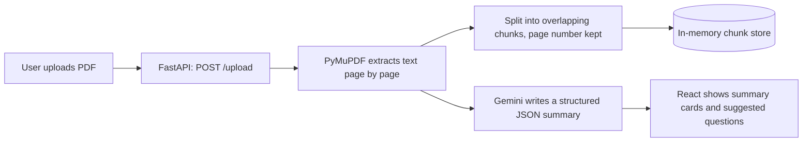
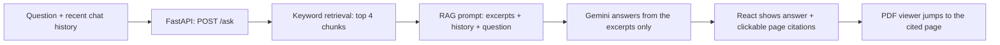

# Research Assistant for PDFs

A full-stack web app that turns a research paper into a structured summary and lets you chat with it, by typing or by voice. Upload a PDF, read the summary, and ask questions. Every answer cites the pages it came from, and clicking a page opens the original PDF at that page.

## Features

- **PDF upload** with live progress steps (extracting text, splitting into sections, building the summary)
- **Structured summary** with Title and Authors, Abstract, Problem Statement, Methodology, Key Results and Conclusion
- **Question answering chatbot** built on retrieval-augmented generation (RAG), answering only from the paper
- **Page citations:** each answer shows clickable page chips
- **Side-by-side PDF viewer:** clicking a citation jumps the PDF to that page
- **Conversation memory:** follow-up questions such as "and what are its limitations?" work
- **Suggested questions:** four tappable starter questions generated from the paper
- **Voice conversation:** speak your question, hear the answer read aloud while the text is shown, then keep talking (Chrome or Edge)
- **Document info bar:** file name, page count, file size, estimated reading time and upload time
- **Graceful fallbacks:** "Not found in this paper" when the document doesn't cover a question, clear errors for scanned or oversized PDFs, and a friendly message when the AI is busy
- **Dark and light themes**, remembered between visits

## System architecture

**When a PDF is uploaded:**



**When a question is asked (typed or spoken):**



### How each stage works

1. **Parsing:** PyMuPDF reads the PDF and extracts the text of every page.
2. **Chunking:** each page is cut into chunks of about 1000 characters with 200 characters of overlap. Every chunk remembers its page number.
3. **Summary:** the text (up to 150,000 characters) goes to Gemini with a prompt that asks for JSON with fixed sections plus four suggested questions.
4. **Retrieval:** the question is split into words, common words are removed, and each chunk is scored by how many of the question's words it contains. Rarer words count for more (a log-scaled, TF-IDF style weight). The top 4 chunks are kept.
5. **RAG prompt:** the 4 chunks (labelled with their pages), the last 6 messages of the conversation and the question go to Gemini, which is told to answer only from the excerpts and to reply `NOT_FOUND` when the paper doesn't cover the question.
6. **Response:** the answer and the cited pages go back to the browser. Clicking a page chip changes the page of the embedded PDF viewer.

### Why keyword retrieval and not embeddings?
Retrieval is kept lightweight on purpose: there is no vector database, no embedding model and no extra service to run, so the app starts with one API key. The trade-off is that matching is based on shared words, not meaning. Swapping in embeddings with a vector index (for example FAISS or Chroma) is a natural next step, and the code is organised so only `backend/rag.py` would change.

## Tech stack

| Layer | Technology |
| --- | --- |
| Frontend | React (Vite), plain CSS, no UI framework |
| Backend | Python, FastAPI, Uvicorn |
| PDF parsing | PyMuPDF |
| LLM | Google Gemini API (`gemini-flash-lite-latest`, with `gemini-flash-latest` as a backup model) |
| Retrieval | In-memory chunk list with keyword scoring (`backend/rag.py`) |
| Voice | Browser Web Speech API (speech recognition and speech synthesis) |
| PDF viewer | The browser's built-in PDF viewer inside an iframe |

**Reliability:** every Gemini call is retried up to 3 times with a short pause, then switches to the backup model. If both fail, the user sees a friendly "AI is busy" message.

## Project structure

```
pdf-research-assistant/
├── backend/
│   ├── main.py            # FastAPI app: /upload, /ask, /pdf, Gemini calls with retries
│   ├── rag.py             # Chunking and retrieval
│   ├── test_gemini.py     # Small script to check that your API key works
│   ├── requirements.txt
│   └── .env.example
├── frontend/
│   ├── src/
│   │   ├── App.jsx        # Pages, chat, PDF panel, upload progress
│   │   ├── App.css        # Layout and component styles
│   │   ├── index.css      # Theme colours and fonts
│   │   └── useVoice.js    # Voice conversation logic
│   └── package.json
└── README.md
```

## API endpoints

| Method | Path | Purpose |
| --- | --- | --- |
| GET | `/` | Health check |
| POST | `/upload` | Upload a PDF (form field `file`). Streams progress messages, then the summary |
| POST | `/ask` | Body: `{ "question": "...", "history": [...] }`. Returns `{ answer, pages, found }` |
| GET | `/pdf` | Returns the uploaded PDF so the viewer can display it |

Interactive API docs are available at `http://127.0.0.1:8000/docs` while the backend is running.

## Setup and running locally

### Prerequisites

- **Python 3.10 or newer** (developed on 3.14)
- **Node.js 20 or newer** (developed on 24)
- **Git**
- A free **Gemini API key** from [Google AI Studio](https://aistudio.google.com) (click "Get API key")

### 1. Clone the repository

```bash
git clone https://github.com/Isla19/pdf-research-assistant.git
cd pdf-research-assistant
```

### 2. Set up and start the backend

```bash
cd backend
python -m venv venv
```

Activate the virtual environment:

- **Windows (PowerShell):** `venv\Scripts\Activate.ps1`
- **macOS / Linux:** `source venv/bin/activate`

(If PowerShell says scripts are disabled, run `Set-ExecutionPolicy -Scope CurrentUser RemoteSigned` once and try again.)

Install the packages:

```bash
pip install -r requirements.txt
```

Create your environment file. Copy `.env.example` to a new file named `.env` in the `backend` folder, then put your key in it:

```
GEMINI_API_KEY=paste-your-key-here
```

Start the server:

```bash
uvicorn main:app --reload
```

The backend now runs at `http://127.0.0.1:8000`. Keep this terminal open.

### 3. Set up and start the frontend

Open a **second terminal** in the project folder:

```bash
cd frontend
npm install
npm run dev
```

Open **http://localhost:5173** in **Chrome or Edge**.

### 4. Try it

1. Click **Click to choose a PDF** and pick a text-based research paper.
2. Wait for the progress steps to finish (the summary step can take 10 to 30 seconds).
3. Read the summary, tap a suggested question or type your own, and click the page chips under answers to see the source in the PDF.
4. Click **Voice conversation**, allow the microphone, and ask a question out loud.

## Configuration notes

- The frontend talks to the backend at `http://127.0.0.1:8000` (set at the top of `frontend/src/App.jsx`), and the backend allows requests from `http://localhost:5173`. Open the app with `localhost`, not `127.0.0.1`.
- The models and limits are set at the top of `backend/main.py`: `MODELS` (primary and backup model), `MAX_CHARS` (text sent for the summary) and the 25 MB upload limit.
- Voice recognition language is set in `frontend/src/useVoice.js` (`rec.lang`, currently `en-GB`), and the silence delay before a spoken question is sent is `SILENCE_MS` (3.5 seconds).

## Known limitations

- **One paper at a time**, held in the server's memory. Restarting the backend clears it, so upload again.
- **Scanned PDFs** (images of text) are not supported because there is no OCR step. The app tells the user when a PDF has no readable text.
- **Retrieval is keyword-based**, so questions that use different words than the paper may retrieve weaker excerpts.
- **Voice** relies on the browser's speech recognition, which works in Chrome and Edge only and needs an internet connection. Recognition accuracy depends on microphone, accent and background noise.
- **The Gemini free tier** has rate limits and can be busy at times. The app retries and falls back to a second model, but a very busy period can still cause an error message.
- The page jump uses the browser's PDF viewer, so it highlights the page, not the exact passage.

## Troubleshooting

| Problem | What to do |
| --- | --- |
| "Cannot reach the server" | Make sure the backend is running on port 8000 |
| `uvicorn` not recognised | Activate the virtual environment first (see step 2) |
| "The AI is busy right now" | Wait a few seconds and try again |
| Voice button missing, or nothing is heard | Use Chrome or Edge, allow the microphone, and check your input device |
| Answers say the paper doesn't cover something it does | Rephrase using words from the paper |